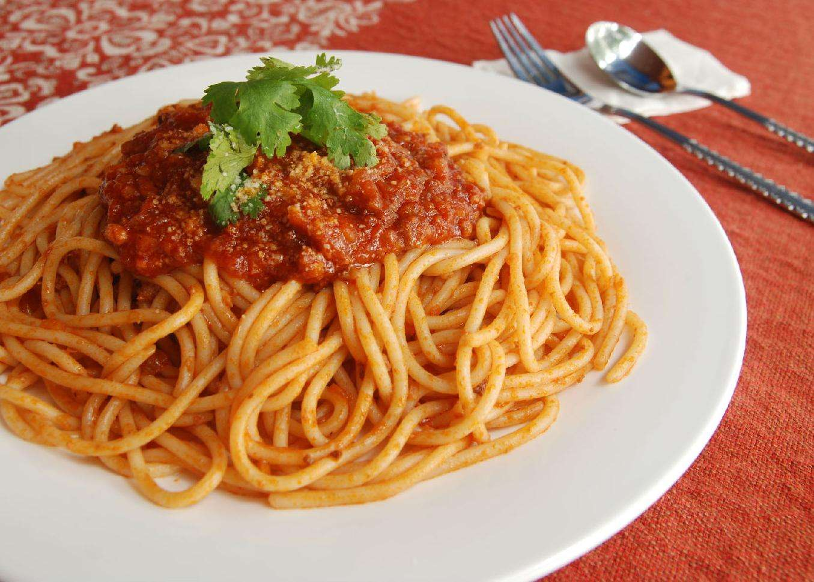

<!DOCTYPE html>
<html lang="en">
<head>
    <meta charset="utf-8">
    <title>Starving all the time.</title>
</head>

<body>
    
    <h2>Roasted duck breast with golden orange juice</h2>
    
    <h4>French Apple Tart</h4>
    
    <a href="https://www.google.com/">Google the recipe</a>
    
     
     
    
    <a href="https://github.com/pinokioo/CS_4320/blob/master/README.md">Link to README.md</a>
       
     
    
    
    
     
     
    
    
    
     
     
    
    
    i would ask:
    
<blockquote>
    
        Eating is enjoyable right?
        Eating is enjoyable right?
        Eating is enjoyable right?
    
</blockquote>

<table border="4">
  <tr>
    <th>Salad</th>
    <th>really</th>
  </tr>
  <tr>
    <td>matters</td>
    <td>right</td>
  </tr>
</table>
    
    
<ul>
<li>Hard</li>
<li>Not</li>
<li>To</li>
<li>Eat</li>
<li>!</li>
</ul>
    
<ol>
<li>Easy</li>
<li>To</li>
<li>Be</li>
<li>Full</li>
</ol>
    
    

Today's calories:

    
    

    
     
    
<b>Dont wanna drive tonight.</b>
 
     
    <i>Can you please drive me there baby?</i>
     
    
<s>Honestly, I hate your favourite restaurant.</s>
 
     
    
    

    
</body>

</html>

